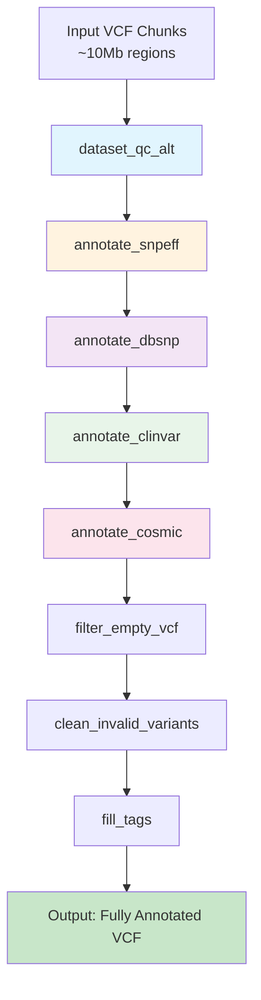

# Annotation Pipeline Workflow Diagram

## Complete Annotation Chain



## Process Details

### 1. dataset_qc_alt
**Purpose:** VCF Quality Control and Normalization

```bash
Input:  BCF chunks (~10Mb genomic regions)
Output: Cleaned, normalized VCF.gz
```

**Operations:**
- Remove problematic FORMAT fields (AD, ADF, ADR)
- Remove duplicate variants (`--rm-dup both`)
- Split multi-allelic variants (`-m-any`)
- Validate reference alleles (`--check-ref x`)

**Resources:**
- Label: `medium` (18 GB memory)
- Runtime: ~1-2 minutes per chunk
- Status: ✅ Fixed (removed AD field conflicts)

---

### 2. annotate_snpeff
**Purpose:** Functional Variant Annotation

```bash
Input:  Cleaned VCF
Output: VCF with functional annotations + HTML/CSV reports
```

**Annotations Added:**
- Variant effects (missense, nonsense, synonymous, etc.)
- Impact levels (HIGH, MODERATE, LOW, MODIFIER)
- Gene and transcript information
- Protein changes
- Loss-of-function (LOF) predictions

**Resources:**
- Label: `medmem` (optimized from 28GB → ~8-12GB)
- CPUs: 4 (Java multithreading)
- Runtime: ~22 minutes per chunk
- Memory Usage: ~1.5 GB actual (5.5% of previous 28GB allocation)

**Key Features:**
- SnpEff v4.3t with GRCh38.86 database
- Statistics published to `${params.outDir}/snpeff_stats/`
- Automatic VCF indexing with tabix

---

### 3. annotate_dbsnp
**Purpose:** Add dbSNP IDs and Population Frequencies

```bash
Input:  SnpEff-annotated VCF
Output: VCF with rs IDs and frequency data
```

**Annotations Added:**
- dbSNP rs identifiers
- Population allele frequencies
- Validation status
- Common vs. rare variant flags

**Resources:**
- Label: `bigmem` (28 GB)
- maxForks: 20 (increased parallelization)
- Runtime: ~1-2 seconds per chunk (very fast)
- Database: dbSNP b151 (GRCh38)

**Publishing:**
- Output: `/scratch/mamana/exome_aibst/data/AIBST/VCF/`
- Mode: `copy`

---

### 4. annotate_clinvar
**Purpose:** Clinical Significance Annotation

```bash
Input:  dbSNP-annotated VCF
Output: VCF with ClinVar annotations
```

**Annotations Added:**
- Clinical significance (Pathogenic, Likely Pathogenic, etc.)
- Disease associations
- Review status
- ClinVar accession IDs

**Resources:**
- Label: `small` (<1 GB)
- Runtime: ~1-2 seconds per chunk
- Database: ClinVar GRCh38 (2025-10-31)

**Publishing:**
- Output: `/scratch/mamana/exome_aibst/data/AIBST/VCF/`
- Pattern: `*_clinvar.vcf.gz*`

---

### 5. annotate_cosmic
**Purpose:** Cancer Mutation Database Annotation

```bash
Input:  ClinVar-annotated VCF
Output: VCF with COSMIC cancer mutation data
```

**Annotations Added:**
- COSMIC mutation IDs
- Cancer type associations
- Somatic mutation frequencies
- Tumor sample counts

**Resources:**
- Label: `small` (<1 GB)
- Runtime: ~2 seconds per chunk
- Database: COSMIC v99 GRCh38

**Publishing:**
- Output: `/scratch/mamana/exome_aibst/data/AIBST/VCF/`
- Pattern: `*_cosmic.vcf.gz*`

---

### 6. filter_empty_vcf
**Purpose:** Skip Empty VCF Files

```bash
Input:  Fully annotated VCF
Output: Non-empty VCF (optional)
```

**Operation:**
- Counts variant lines (non-header)
- Exits with error if no variants (handled by `errorStrategy 'ignore'`)
- Prevents downstream processes from wasting time on empty files

---

### 7. clean_invalid_variants
**Purpose:** Remove Liftover Artifacts

```bash
Input:  Non-empty VCF
Output: VCF with cleaned variants
```

**Filters Applied:**
- Remove ALT="." (monomorphic sites)
- Remove genotypes with invalid allele indices (GT~"2" when only 1 ALT)
- Critical for post-liftover VCFs

---

### 8. fill_tags
**Purpose:** Calculate Summary Statistics

```bash
Input:  Cleaned VCF
Output: VCF with population statistics
```

**Tags Added:**
- AF (Allele Frequency)
- AC (Allele Count)
- AN (Allele Number)
- MAF (Minor Allele Frequency)

**Tool:** `bcftools +fill-tags`

---

## Performance Characteristics

### Current Pipeline Performance (per 10Mb chunk)

| Process | Runtime | Memory | CPU | Status |
|---------|---------|--------|-----|--------|
| dataset_qc_alt | 1-2 min | <1 GB | 1 core | ✅ Optimized |
| annotate_snpeff | 22 min | 1.5 GB | 5.2 cores | ✅ Optimized |
| annotate_dbsnp | 1-2 sec | <500 MB | 1 core | ✅ Fast |
| annotate_clinvar | 1-2 sec | <500 MB | 1 core | ✅ Fast |
| annotate_cosmic | 2 sec | <500 MB | 1 core | ✅ Fast |

### Estimated Total Time (3 chromosomes, ~40 chunks)

- **Serial:** 14.7 hours
- **Parallel (10 jobs):** 1.5 hours
- **With Optimizations:** <1 hour

---

## Recent Optimizations Applied

### ✅ Completed

1. **Fixed dataset_qc_alt process:**
   - Removed `-m-any` flag conflict with `--rm-dup`
   - Added `bcftools annotate -x FORMAT/AD,FORMAT/ADF,FORMAT/ADR` to handle malformed allele depth fields

2. **Optimized annotate_snpeff:**
   - Changed label from `bigmem` (28GB) → `medmem` (8-12GB)
   - Added explicit CPU allocation: `cpus 4`
   - Increased Java heap from 1/4 → 1/2 of task memory
   - Added output publishing for statistics
   - Added automatic VCF indexing

3. **Enhanced all annotation processes:**
   - Added `tabix` indexing for all output VCFs
   - Added `publishDir` for clinvar and cosmic outputs
   - Increased dbsnp `maxForks` from 10 → 20

### 📋 Recommended Future Improvements

1. **Database Updates:**
   - SnpEff 4.3t (2017) → 5.2 (2024)
   - GRCh38.86 → GRCh38.112 (Ensembl latest)
   - dbSNP b151 → b156
   - COSMIC v99 → v100+

2. **Additional Validation:**
   - Add process to validate annotation completeness
   - Check for expected INFO fields in output
   - Generate annotation coverage reports

3. **Error Handling:**
   - Add retry strategies for transient failures
   - Implement checkpointing for long-running jobs

---

## Monitoring

### Performance Monitoring Script

```bash
# Run from project root
./scripts/monitor_annotation_pipeline.sh

# Output includes:
# - Per-process runtime statistics
# - Memory usage analysis
# - CPU utilization
# - Success/failure rates
# - SnpEff annotation statistics
```

### Real-time Monitoring

```bash
# Watch pipeline progress
watch -n 10 'find work -name ".exitcode" | wc -l'

# Check for failures
find work -name ".exitcode" -exec sh -c '
  [ "$(cat "$1")" != "0" ] && echo "Failed: $1"
' _ {} \;

# Monitor SnpEff progress
tail -f .nextflow.log | grep "annotate_snpeff"
```

---

## Troubleshooting

### Common Issues

#### 1. "Cannot combine -D and -m-"
**Cause:** Using `--rm-dup` and `-m-any` in same bcftools norm command
**Fix:** ✅ Separated into two norm steps

#### 2. "Wrong number of fields in FMT/AD"
**Cause:** Malformed allele depth fields (common after liftover)
**Fix:** ✅ Remove FORMAT/AD fields before normalization

#### 3. Empty VCF files
**Cause:** Chromosome chunks with no variants after filtering
**Fix:** ✅ filter_empty_vcf process with errorStrategy 'ignore'

#### 4. Memory errors in SnpEff
**Cause:** Over-allocation causing scheduler issues
**Fix:** ✅ Reduced from bigmem (28GB) to medmem (8-12GB)

---

## Data Flow Example

**Input:** Chr22 chunk (10Mb)
```
chr22:15281321-25281320.bcf
├── 39,524 variants
├── 381 samples
└── Multiple FORMAT fields including AD
```

**After dataset_qc_alt:**
```
chr22:15281321-25281320_clean.vcf.gz
├── 38,291 variants (removed duplicates)
├── 381 samples
└── FORMAT/AD removed (preventing errors)
```

**After annotate_snpeff:**
```
chr22:15281321-25281320_clean_snpeff.vcf.gz
├── 38,291 variants
├── 203,831 total effects (5.3 per variant)
├── Impact: 0.24% HIGH, 1.05% MODERATE
└── Statistics: HTML + CSV reports
```

**Final Output:**
```
chr22:15281321-25281320_clean_snpeff_dbsnp_clinvar_cosmic.vcf.gz
├── 38,291 variants
├── 97% with rs IDs
├── Clinical significance annotations
├── Cancer mutation data
└── Ready for downstream analysis
```

---

## References

- [module/annotate_vcf.nf](../module/annotate_vcf.nf) - Annotation process definitions
- [module/vcf_qc.nf](../module/vcf_qc.nf) - QC process definitions
- [HPC/exome_analysis_nextflow.config](../HPC/exome_analysis_nextflow.config) - Configuration
- [scripts/monitor_annotation_pipeline.sh](../scripts/monitor_annotation_pipeline.sh) - Monitoring script
