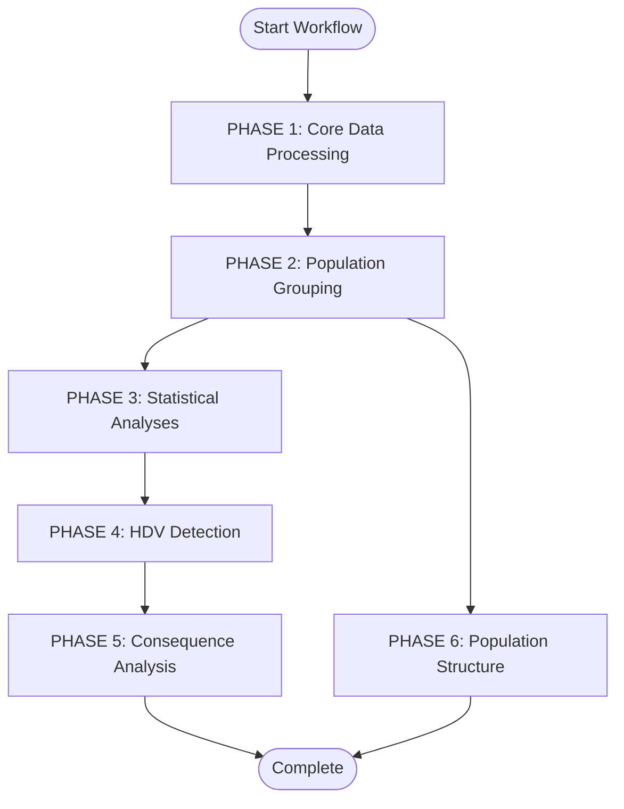
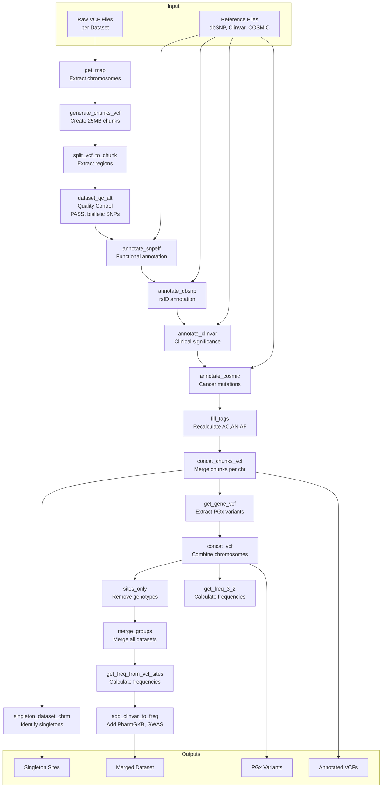
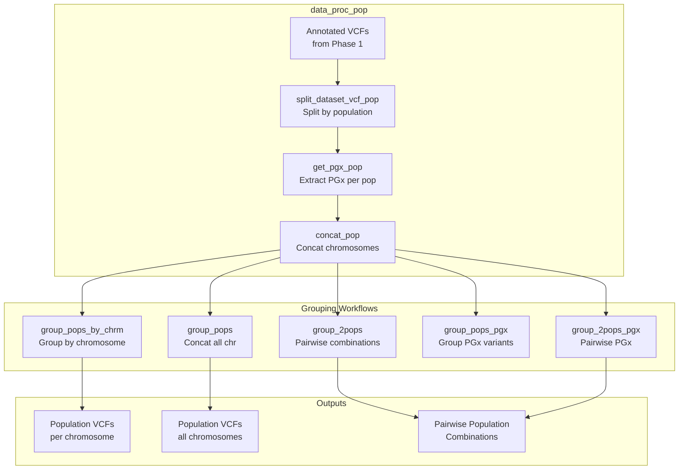
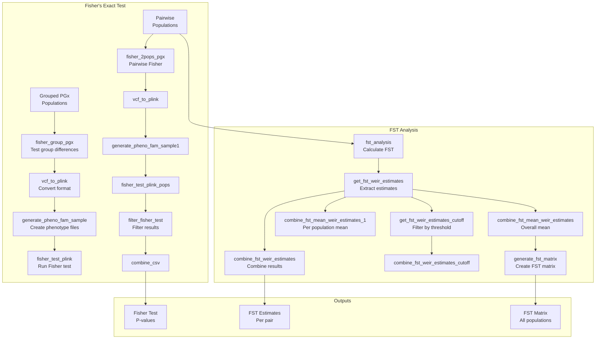
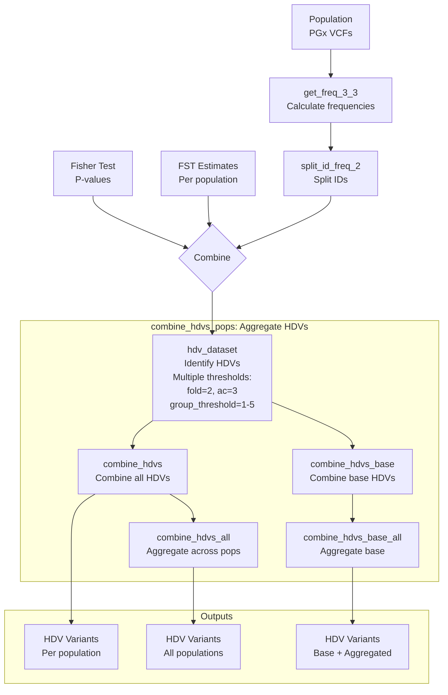
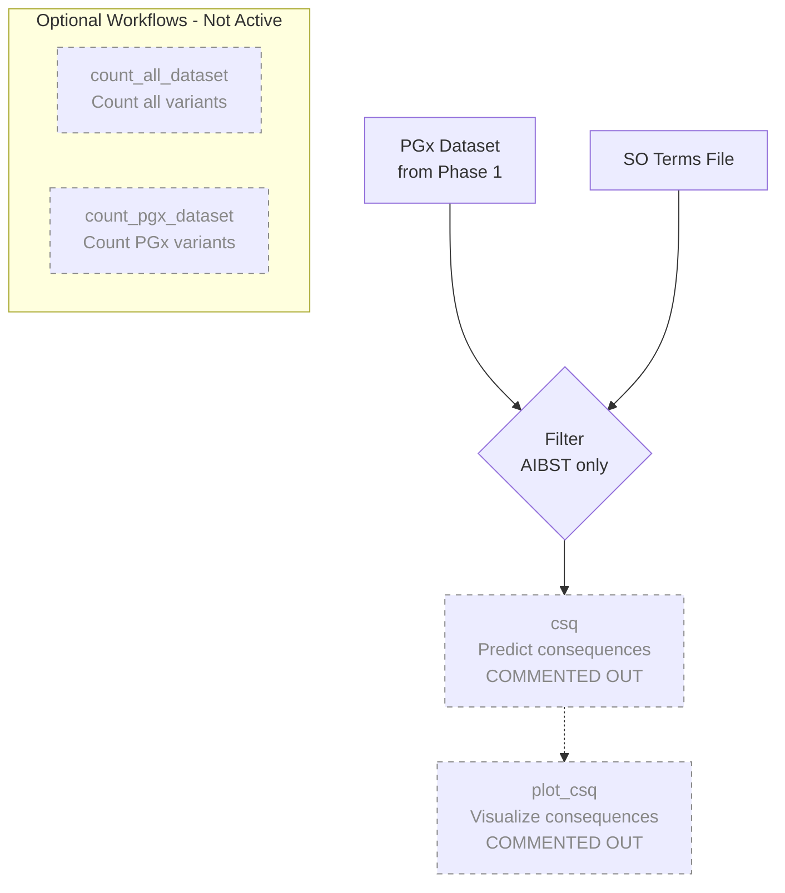
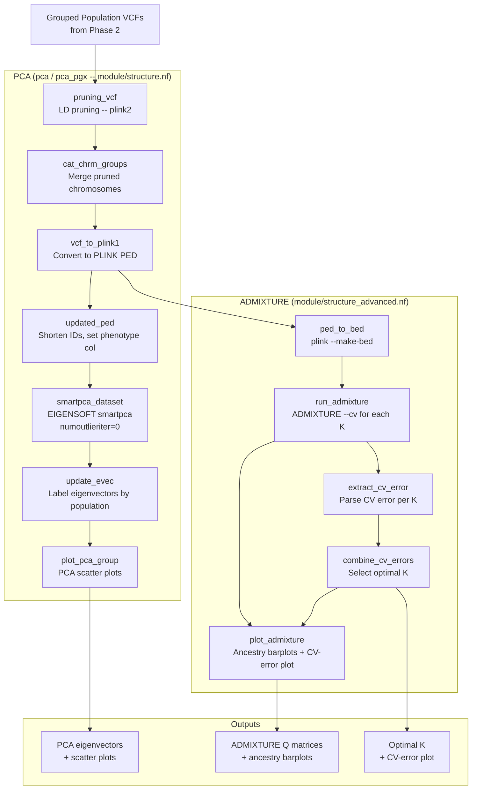
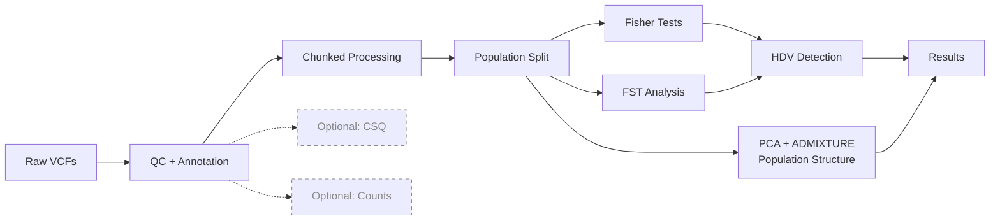

# Exome Analysis Workflow Architecture - Visual Graph

## Main Workflow Overview

## PHASE 1: Core Data Processing (data_proc)

## PHASE 2: Population Grouping

## PHASE 3: Statistical Analyses

## PHASE 4: HDV Detection (Highly Differentiated Variants)

## PHASE 5: Consequence Analysis (Optional)

## PHASE 6: Population Structure (PCA & ADMIXTURE)

Principal Component Analysis (EIGENSOFT `smartpca`) and ADMIXTURE ancestry
estimation run on the grouped population VCFs from Phase 2. Both are active
analyses underlying the population-structure figures in the manuscript.

## Data Flow Summary

## Key Process Characteristics

### Resource-Intensive Processes (BigMem/ExtraBig)

- `annotate_snpeff` - Functional annotation
- `get_map` - Chromosome extraction
- `fst_analysis` - Population differentiation
- `merge_pop_groups` - Large VCF merging

### Parallel Processing

- Chunks: 25MB regions processed in parallel
- Chromosomes: All requested chromosomes processed simultaneously
- Populations: Per-population analyses run in parallel
- Pairwise: All population pairs processed concurrently

### Caching Strategy

All processes support Nextflow caching with `-resume`:

- Previously successful processes reuse cached results
- Only failed or new processes re-execute
- Dramatically reduces re-run time (hours → seconds)

## Legend

- 🟦 Blue: Input/Data processing
- 🟩 Green: Annotation/Analysis
- 🟨 Yellow: Transformation/Grouping
- 🟪 Purple: Statistical tests
- ⬜ Gray (dashed): Optional/Commented out
